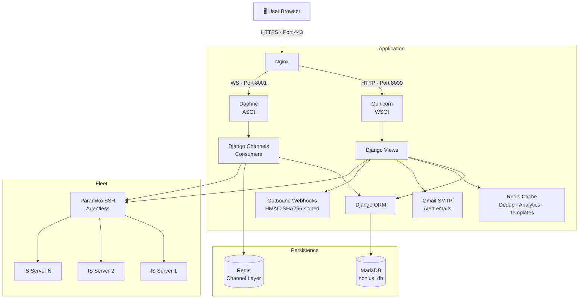

  

  
    
  
  

---

### 🧠 About Me

- 🎓 **Telecommunications and Informatics Engineering** graduate — University of Minho, Guimarães, Portugal.
- 🌍 Based in **Guimarães, Portugal**.
- 🔭 Currently developing a **full-stack web application with Django** — focusing on REST APIs, robust backend architecture, and data management.
- 🔌 Passionate about the intersection of **software and hardware** — from IoT sensors to the cloud.
- 🛠️ Hands-on with **microcontrollers** (Arduino, ESP8266) and embedded systems.
- ⚙️ Interested in building **scalable systems, real-time architectures, and hardware-integrated platforms**.
- 🌱 Currently deepening my knowledge in **system design, scalability, and distributed systems**.

---

### 🚀 Featured Work

🔒 **Infrastructure Observability Portal (Private)**
- Django + REST API + authentication
- Real-time features using WebSockets with Redis (pub/sub architecture)
- Designed backend architecture, database schema, and production deployment with Nginx + Gunicorn
- Demo available upon request

<b>👁️ View System Architecture</b>

 

🔌 **[NEXCAR: IoT Vehicle Monitoring System](https://github.com/josenovais97/NEXCAR-Real-Time-IoT-Vehicle-Control-and-Monitoring-Platform)**
- ESP8266 + MQTT communication
- Real-time data ingestion and backend integration
- Designed for scalable, low-latency communication using MQTT and real-time messaging
  
---

### 🛠️ Languages & Tools

**Backend & Web**

  
  
  
  
  
  
  

**Real-Time & Infrastructure**

  
  
  
  
  
  

**Systems & Embedded**

  
  
  
  
  
  
  

---

### 📊 GitHub Stats

  
  
  

---

  

